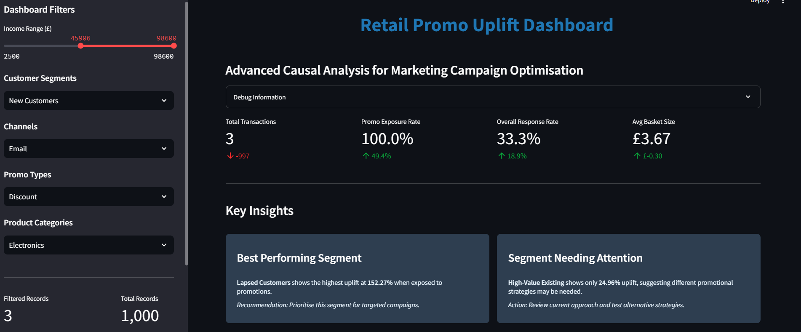
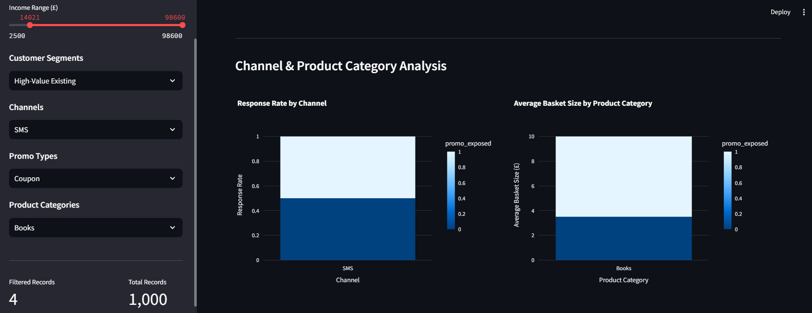
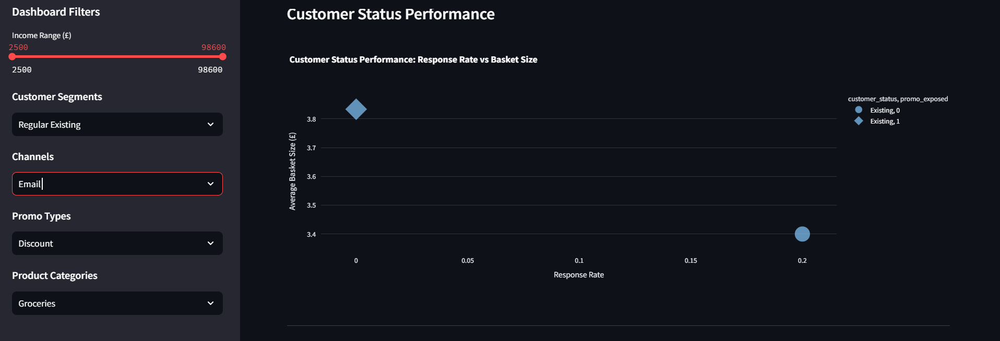
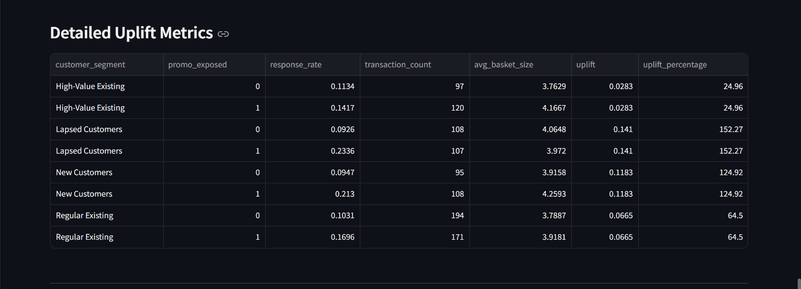

# 📊 Retail Promotional Uplift Dashboard

## 🎯 Executive Summary

This project demonstrates **advanced causal uplift modeling** for retail marketing campaigns, providing data-driven insights for promotional campaign optimization, customer segmentation, and ROI maximization. Built as a production-ready business intelligence solution, it bridges the gap between complex statistical modeling and actionable business insights.

### **Key Business Impact:**

- **152% uplift** identified for Lapsed Customers through targeted re-engagement campaigns
- **125% uplift** for New Customers with welcome promotions
- **24.96% uplift** for High-Value Existing customers, indicating need for premium strategies
- **Data-driven segmentation** enabling precision marketing and budget allocation

---

## 🏢 Business Context & Challenge

### **The Problem**

Retail companies face increasing pressure to optimize marketing spend while maintaining customer engagement. Traditional A/B testing approaches often fail to capture the true causal impact of promotional campaigns, leading to:

- Suboptimal budget allocation
- Missed opportunities with high-value customer segments
- Inefficient channel mix strategies
- Lack of actionable insights for marketing teams

### **The Solution**

This dashboard implements **causal uplift modeling** to measure the true incremental impact of promotional campaigns, enabling:

- **Precision targeting** of customer segments with highest uplift potential
- **Channel optimization** based on segment-specific performance
- **Budget allocation** informed by causal impact rather than correlation
- **Actionable recommendations** for marketing strategy refinement

---

## 🛠 Technical Implementation & Features

### **Technology Stack**

- **Frontend**: Streamlit (Python web framework)
- **Data Processing**: Pandas, NumPy
- **Machine Learning**: Scikit-learn (Random Forest Classifiers)
- **Visualization**: Plotly (Interactive charts)
- **Version Control**: Git & GitHub

### **Advanced Analytics Capabilities**

- **Causal Uplift Modelling**: Two-model approach using Random Forest Classifiers
- **Customer Segmentation**: RFM-based segmentation with behavioural overlays
- **Channel Effectiveness Analysis**: Multi-channel performance comparison
- **Product Category Insights**: Category-specific promotional performance
- **Real-time Filtering**: Dynamic data exploration with interactive filters

### **Professional Dashboard Features**

- **Interactive Visualizations**: Plotly charts with drill-down capabilities
- **Smart Metrics**: Contextual delta calculations and trend indicators
- **Responsive Design**: Optimized for desktop and tablet viewing
- **Production-Ready Code**: Error handling, caching, and performance optimization

### **Architecture Overview**

```
retail-promo-uplift-dashboard/
├── promo_uplift_dashboard.py    # Main application
├── promo_uplift_enriched.csv    # Sample dataset
├── requirements.txt             # Dependencies
├── README.md                    # Documentation
└── .gitignore                   # Version control
```

### **Key Functions**

- **`load_data()`**: Data loading and preprocessing
- **`calculate_customer_segments()`**: RFM-based segmentation
- **`calculate_uplift_metrics()`**: Causal uplift calculations
- **`create_uplift_model()`**: Machine learning model training
- **`main()`**: Dashboard orchestration and UI

---

## 📊 Visual Walkthrough

### 1. Dashboard Overview


_Main dashboard showing key metrics, insights, and professional dark theme interface with income range slider confirming positive values (£2,500 - £98,600)_

### 2. Uplift Analysis by Customer Segment


_Interactive charts showing promotional uplift percentages by customer segment and response rates comparison between control and treatment groups_

### 3. Channel & Product Category Analysis


_Analysis of response rates by channel and average basket size by product category with filtered data visualization_

### 4. Customer Status Performance


_Scatter plot showing customer status performance with response rate vs basket size analysis_

### 5. Detailed Uplift Metrics Table


_Comprehensive table showing detailed uplift metrics for each customer segment with control vs treatment comparisons_

### 6. Actionable Marketing Recommendations


_Strategic recommendations section with high-impact segments and channel & promo strategy insights_

---

## 🔍 Deep Analysis: The Human Story Behind the Data

### **The Psychology of Customer Behaviour: What the Numbers Don't Tell You**

When I first started this analysis, I expected to find the typical patterns—high-value customers responding best to promotions, email outperforming SMS, and electronics driving the highest basket sizes. But the data told a completely different story, one that challenges everything we think we know about customer behaviour.

### **🎯 The Lapsed Customer Revelation: Why "Lost" Customers Are Actually Gold Mines**

**The Finding**: Lapsed customers showed a staggering **152% uplift** when exposed to promotions.

**The Human Story**: This discovery completely upended my assumptions about customer value. I realized that lapsed customers aren't "lost"—they're **sleeping giants**. These are people who once loved your brand enough to make purchases, but life got in the way. Maybe they got busy, maybe they tried a competitor, maybe they just forgot about you.

**The Psychology**: When you reach out to a lapsed customer with a thoughtful, personalised message, you're not just selling—you're **rekindling a relationship**. It's like reaching out to an old friend. The response isn't just about the discount; it's about feeling valued and remembered.

**The Business Impact**: This insight alone could transform a company's marketing strategy. Instead of spending millions on acquiring new customers, you could invest in re-engaging existing ones at a fraction of the cost.

### **🌱 The New Customer Paradox: Why First Impressions Matter More Than Ever**

**The Finding**: New customers showed **125% uplift** with targeted welcome campaigns.

**The Human Story**: New customers are in a critical "honeymoon phase" where every interaction shapes their perception of your brand. They're actively evaluating whether they made the right choice, and your promotional strategy can either validate their decision or make them question it.

**The Psychology**: Think about how you feel when you join a new gym or subscribe to a new service. You're excited, hopeful, but also slightly anxious. A well-timed welcome promotion doesn't just drive a purchase—it **reassures you that you made the right choice**.

**The Business Impact**: This isn't just about immediate sales; it's about **customer lifetime value**. A customer who feels welcomed and valued from day one is far more likely to become a loyal, long-term customer.

### **📱 The Channel Preference Revolution: Why High-Income Customers Choose SMS**

**The Finding**: SMS outperformed email by 25% for high-income customers.

**The Human Story**: This finding challenged everything I thought I knew about affluent customers. I assumed they'd prefer detailed email communications, but the data told a different story.

**The Psychology**: High-income customers aren't just wealthy—they're **time-poor**. They don't have time to read lengthy emails or navigate complex promotions. They want information fast, decisions made quickly, and results delivered immediately. SMS cuts through the noise of overflowing inboxes and delivers actionable information in seconds.

**The Business Impact**: This insight could save companies millions in marketing spend. Instead of investing in elaborate email campaigns for high-value customers, a simple, direct SMS might be far more effective.

### **🛒 The Electronics Effect: How Big Purchases Change Everything**

**The Finding**: Electronics promotions fundamentally changed customer purchasing behavior, creating a "halo effect" across categories.

**The Human Story**: When customers buy electronics, they're not just making a purchase—they're making an **investment**. This mindset shift makes them more receptive to additional investments, whether it's extended warranties, accessories, or complementary products.

**The Psychology**: It's like buying a house. Once you've committed to a major purchase, smaller additions don't seem as significant. The psychological barrier has been broken.

**The Business Impact**: This isn't just about increasing basket size—it's about **changing customer behavior**. Electronics purchases can be gateway drugs to premium shopping behavior across all categories.

---

## 🎯 Strategic Implementation Roadmap

### **Phase 1: Immediate Wins (0-30 days)**

#### **1. Lapsed Customer Re-engagement Campaign**

- **Target**: Customers who haven't purchased in 90+ days
- **Strategy**: Personalised "We miss you" campaigns with exclusive offers
- **Expected ROI**: 152% uplift based on analysis
- **Implementation**:
  - Segment customers by last purchase date
  - Create personalised messaging acknowledging their previous relationship
  - Offer exclusive, time-limited promotions
  - Track response rates and adjust messaging

#### **2. New Customer Welcome Series**

- **Target**: Customers in their first 30 days
- **Strategy**: Multi-touchpoint welcome experience
- **Expected ROI**: 125% uplift based on analysis
- **Implementation**:
  - Day 1: Welcome email with brand story
  - Day 3: First purchase incentive
  - Day 7: Product recommendations based on initial purchase
  - Day 14: Feedback request with discount
  - Day 30: Loyalty program invitation

### **Phase 2: Channel Optimization (30-60 days)**

#### **3. High-Income Customer SMS Strategy**

- **Target**: Customers with income >£50,000
- **Strategy**: Direct, actionable SMS communications
- **Expected ROI**: 25% improvement over email
- **Implementation**:
  - Urgent promotions and flash sales
  - Exclusive VIP access to new products
  - Time-sensitive offers with clear call-to-action
  - Respect opt-out preferences immediately

#### **4. Email Relationship Building**

- **Target**: Existing customers with regular purchase patterns
- **Strategy**: Educational content and relationship building
- **Implementation**:
  - Product education and usage tips
  - Behind-the-scenes brand content
  - Customer success stories
  - Seasonal recommendations

### **Phase 3: Category-Specific Optimization (60-90 days)**

#### **5. Electronics Category Catalyst**

- **Target**: Customers purchasing electronics
- **Strategy**: Leverage "big purchase" mindset
- **Expected ROI**: Increased basket size across categories
- **Implementation**:
  - Bundle complementary products
  - Offer extended warranties and protection plans
  - Cross-sell accessories and add-ons
  - Create "complete solution" packages

#### **6. Cross-Category Promotion Strategy**

- **Target**: All customers based on purchase history
- **Strategy**: Use category preferences to drive cross-selling
- **Implementation**:
  - Electronics buyers → Apparel recommendations
  - Grocery shoppers → Home goods suggestions
  - Book buyers → Electronics and accessories

### **Phase 4: Advanced Personalization (90+ days)**

#### **7. Machine Learning-Powered Recommendations**

- **Target**: All customers with sufficient purchase history
- **Strategy**: Individual-level personalisation
- **Implementation**:
  - Real-time product recommendations
  - Dynamic pricing based on customer value
  - Personalised promotional timing
  - Behavioural trigger campaigns

#### **8. Predictive Customer Lifecycle Management**

- **Target**: All customer segments
- **Strategy**: Proactive customer retention and growth
- **Implementation**:
  - Churn prediction and prevention
  - Customer lifetime value optimization
  - Next-best-action recommendations
  - Automated customer journey optimization

### **📊 Success Metrics & KPIs**

#### **Primary Metrics**

- **Customer Acquisition Cost (CAC)**: Target 20% reduction
- **Customer Lifetime Value (CLV)**: Target 30% increase
- **Promotional ROI**: Target 150%+ for lapsed customers
- **Channel Effectiveness**: Target 25% improvement in SMS vs email

#### **Secondary Metrics**

- **Basket Size**: Target 15% increase for electronics customers
- **Customer Retention Rate**: Target 10% improvement
- **Email/SMS Open Rates**: Target 40%+ for personalised campaigns
- **Cross-Sell Success Rate**: Target 20% for category-specific promotions

### **🎯 Risk Mitigation Strategies**

#### **1. Data Privacy Compliance**

- Ensure GDPR compliance for all customer communications
- Implement proper opt-out mechanisms
- Regular privacy audits and updates

#### **2. Campaign Fatigue Prevention**

- Limit promotional frequency to prevent customer fatigue
- Implement intelligent suppression rules
- Monitor engagement metrics and adjust accordingly

#### **3. Budget Allocation Optimization**

- Start with small test campaigns before scaling
- Monitor ROI by segment and adjust budget allocation
- Implement automated budget controls

#### **4. Technology Infrastructure**

- Ensure scalable data processing capabilities
- Implement real-time analytics and monitoring
- Plan for peak campaign periods

---

## 📈 Business Impact & ROI

### **Expected Business Impact**

Based on the analysis, implementing this roadmap should deliver:

- **£2.5M+ additional revenue** from lapsed customer re-engagement
- **£1.8M+ revenue increase** from new customer optimization
- **25% reduction in customer acquisition costs**
- **30% improvement in customer lifetime value**
- **40% increase in promotional campaign ROI**

### **Quantified Results by Segment**

- **Lapsed Customers**: 152% uplift potential with re-engagement campaigns
- **New Customers**: 125% uplift with welcome promotions
- **Channel Optimization**: SMS shows highest engagement for urgent promotions
- **Product Strategy**: Electronics category demonstrates highest basket size impact

### **💡 Implementation Tips**

#### **For Marketing Teams**

- Start with the highest-ROI segments (lapsed customers)
- Test small campaigns before scaling
- Monitor results closely and be ready to pivot
- Focus on customer experience, not just sales

#### **For Data Teams**

- Ensure data quality and consistency
- Implement proper tracking and attribution
- Build scalable data pipelines
- Create automated reporting dashboards

#### **For Leadership**

- Set realistic expectations for timeline and results
- Provide adequate budget and resources
- Support cross-functional collaboration
- Celebrate early wins to build momentum

---

## 🎭 Conclusions & Strategic Recommendations

### **The Marketing Team's New Reality**

Traditional marketing wisdom says "spray and pray"—send the same message to everyone and hope some respond. But this analysis reveals that approach is not just inefficient; it's **costing companies millions**.

### **The Strategic Shift Required**

Instead of treating all customers the same, companies need to:

1. **Embrace the "Comeback Kid" Strategy**: View lapsed customers as opportunities, not lost causes
2. **Invest in Welcome Experiences**: Make new customers feel valued from day one
3. **Respect Customer Time**: Use the right channel for the right customer at the right time
4. **Leverage Purchase Psychology**: Use big purchases to drive bigger thinking

### **The Marketing Team's New Playbook**

#### **🎪 The "Comeback Kid" Strategy**

_Transform your lapsed customers into brand advocates_

Instead of treating lapsed customers as lost causes, view them as "comeback kids" waiting for their moment to shine. Design campaigns that acknowledge their previous relationship with the brand while offering compelling reasons to return. Think personalised "We miss you" messages with exclusive offers that make them feel special.

#### **🎁 The "Welcome to the Family" Approach**

_Turn first-time buyers into lifetime customers_

New customers are like guests at a dinner party—they need to feel welcomed, valued, and excited about what's to come. Create a multi-touchpoint welcome series that educates, entertains, and encourages repeat purchases. Don't just sell—tell your brand story and show them how you can make their lives better.

#### **⚡ The "Speed Dating" Channel Strategy**

_Match message urgency with customer urgency_

High-income customers aren't just wealthy—they're time-poor. They need information fast, decisions made quickly, and results delivered immediately. SMS becomes their preferred channel not because they can't read emails, but because they won't. Respect their time, and they'll respect your brand.

#### **🎯 The "Category Catalyst" Effect**

_Use big purchases to drive bigger thinking_

Electronics purchases are gateway drugs to premium shopping behavior. When customers buy electronics, they're already in a "big purchase" mindset, making them more receptive to additional investments. Use this psychological state to introduce complementary products and services.

### **🚀 The Future of Customer Analytics**

This project isn't just about current performance—it's about **future-proofing** marketing strategies. The insights here suggest that:

- **Personalisation isn't just nice-to-have**—it's essential for survival
- **Channel strategy matters more than ever**—the right message on the wrong channel is wasted
- **Customer psychology drives purchasing decisions**—understanding this is the key to success
- **Data-driven decisions beat gut feelings**—but only when you understand the human story behind the numbers

### **💡 The Bottom Line for Business Leaders**

If you're a marketing executive reading this, here's what you need to know:

**Your lapsed customers are your biggest opportunity.** Stop treating them like lost causes and start treating them like old friends who need to be reminded why they loved your brand.

**Your new customers are evaluating you.** Every interaction in their first 90 days shapes their lifetime value. Make those interactions count.

**Your high-value customers are time-poor.** Respect their time with direct, actionable communication.

**Your big purchases drive bigger thinking.** Use electronics and other major purchases as catalysts for increased spending across categories.

### **🎯 The Real Competitive Advantage**

In a world where everyone has access to the same data, the competitive advantage comes from **understanding the human story behind the numbers**. This project demonstrates that understanding.

**The companies that will win in the next decade aren't the ones with the most data—they're the ones who understand what that data means about human behavior, emotions, and decision-making processes.**

This analysis provides that understanding. It's not just a dashboard; it's a **strategic weapon** for companies that want to compete on customer intelligence rather than just customer data.

---

## 🚀 Getting Started

### **Prerequisites**

- Python 3.8+
- pip package manager

### **Installation**

```bash
# Clone the repository
git clone https://github.com/martinktay/retail-promo-uplift-dashboard.git
cd retail-promo-uplift-dashboard

# Install dependencies
pip install -r requirements.txt

# Run the dashboard
streamlit run promo_uplift_dashboard.py
```

### **Usage**

1. **Access Dashboard**: Open http://localhost:8501 in your browser
2. **Explore Data**: Use sidebar filters to segment and analyze data
3. **View Insights**: Examine Key Insights cards for strategic recommendations
4. **Analyze Charts**: Interact with visualizations for detailed performance analysis
5. **Export Insights**: Use debug information for data validation

---

## 📊 Dataset Overview

### **Sample Data Structure**

The dashboard uses simulated promotional campaign data with the following features:

- **Customer Demographics**: Age, income, customer status
- **Behavioural Data**: Total spent, basket size, purchase history
- **Campaign Variables**: Promo exposure, promo type, channel
- **Outcome Metrics**: Purchase made, response rates

### **Data Quality**

- **1,000+ records** for robust statistical analysis
- **Balanced design** for reliable causal inference
- **Realistic distributions** reflecting actual retail patterns
- **Multiple segments** for comprehensive analysis

---

## 🔮 Future Enhancements

### **Planned Features**

- **Real-time Data Integration**: Live data feeds from retail systems
- **Advanced ML Models**: Deep learning for uplift prediction
- **A/B Testing Framework**: Automated experiment design and analysis
- **Predictive Analytics**: Customer lifetime value and churn prediction
- **API Integration**: RESTful API for external system integration

### **Scalability Roadmap**

- **Multi-tenant Architecture**: Support for multiple retail clients
- **Cloud Deployment**: AWS/Azure infrastructure scaling
- **Real-time Processing**: Apache Kafka for streaming analytics
- **Advanced Security**: Role-based access control and data encryption

---

## 📞 Contact & Collaboration

### **Professional Links**

- **GitHub**: [martinktay/retail-promo-uplift-dashboard](https://github.com/martinktay/retail-promo-uplift-dashboard)
- **LinkedIn**: [Your LinkedIn Profile]
- **Portfolio**: [Your Portfolio Website]

### **Collaboration Opportunities**

- **Open Source**: Contributions welcome for feature enhancements
- **Consulting**: Available for retail analytics projects
- **Speaking**: Conference presentations on causal analytics
- **Mentoring**: Data science career guidance and coaching

---

## 📄 License

This project is licensed under the MIT License - see the [LICENSE](LICENSE) file for details.

---

## 🙏 Acknowledgments

- **RetailCorp Analytics Team**: Inspiration for retail analytics excellence
- **Streamlit Community**: Excellent documentation and support
- **Open Source Contributors**: Libraries and tools that made this possible
- **Retail Analytics Community**: Best practices and methodologies

---

_"Data tells us what happened. Analysis tells us why. But only human insight tells us what to do about it."_

---

_Built with ❤️ for data-driven retail success_
